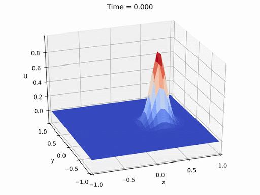

[![Contributors][contributors-shield]][contributors-url]
[![Forks][forks-shield]][forks-url]
[![Stargazers][stars-shield]][stars-url]
[![Issues][issues-shield]][issues-url]
[![MIT License][license-shield]][license-url]
[![LinkedIn][linkedin-shield]][linkedin-url]

<!-- PROJECT LOGO -->
 

  

  <h3 align="center">Gemi  ve Deniz Teknolojisi Mühendisleri için Sayısal Yöntemler</h3>

<!-- TABLE OF CONTENTS -->
## İçindekiler

* [Hakkında](#Hakkında)
* [Lisans](#Lisans)
* [İletişim](#İletişim)

<!-- ABOUT THE PROJECT -->
## Hakkında
Bu repo gemi mühendisleri için sayısal yöntemler konu başlığı ilgili içeriklerden oluşturulmuştur.

<!-- LICENSE -->
## Lisans

Bu repo'daki tüm içerikler özgürce kullanılabilir ve paylaşılabilir.

<!-- CONTACT -->
## İletişim

Baran Serdar Sarıoğlu - sariogluba@itu.edu.tr

Proje Linki: [https://github.com/sariogluba/sayisalyontemler](https://github.com/sariogluba/sayisalyontemler)

<!-- MARKDOWN LINKS & IMAGES -->
<!-- https://www.markdownguide.org/basic-syntax/#reference-style-links -->
[contributors-shield]: https://img.shields.io/github/contributors/othneildrew/Best-README-Template.svg?style=flat-square
[contributors-url]: https://github.com/othneildrew/Best-README-Template/graphs/contributors
[forks-shield]: https://img.shields.io/github/forks/othneildrew/Best-README-Template.svg?style=flat-square
[forks-url]: https://github.com/othneildrew/Best-README-Template/network/members
[stars-shield]: https://img.shields.io/github/stars/othneildrew/Best-README-Template.svg?style=flat-square
[stars-url]: https://github.com/othneildrew/Best-README-Template/stargazers
[issues-shield]: https://img.shields.io/github/issues/othneildrew/Best-README-Template.svg?style=flat-square
[issues-url]: https://github.com/othneildrew/Best-README-Template/issues
[license-shield]: https://img.shields.io/github/license/othneildrew/Best-README-Template.svg?style=flat-square
[license-url]: https://github.com/othneildrew/Best-README-Template/blob/master/LICENSE.txt
[linkedin-shield]: https://img.shields.io/badge/-LinkedIn-black.svg?style=flat-square&logo=linkedin&colorB=555
[linkedin-url]: https://linkedin.com/in/baran-serdar-s-22481059/
